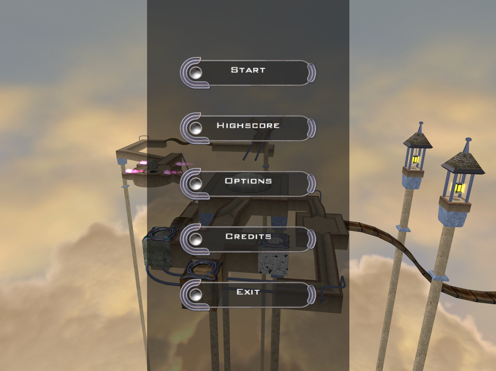

# Ballance React/Threejs Port

This is Ballance game binary ported to React TS + Three.js.

***Play Ballance in browser***

An original-binary-first reconstruction of the complete 2004 game for the browser. The port
decodes the shipped Virtools scenes and behavior data into React, TypeScript, Three.js, and
Rapier while preserving the source-authored levels, physics, camera, HUD, menus, animation,
audio, scoring, and progression. Runtime assets are repository-owned under `public/game` and
are bundled into a self-contained `dist/`; the read-only `Ballance_bin/source1` and `source2`
trees remain the complementary primary authority for every fidelity decision.
